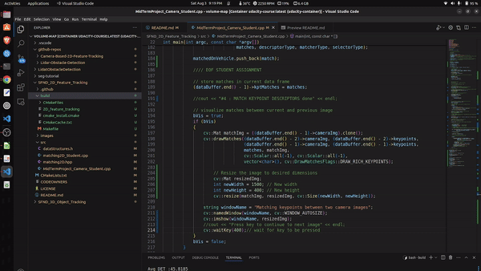

# Camera-Based-2D-Feature-Tracking

This mini-project is an exhaustive comparison between different keypoint detectors and descriptors present in C++ OpenCV library. The matching is performed on a suquence from KITTI DATASET. Below are the results and observation from my implementation. 

The starter code is taken from Udacity Sensor Fusion github. 




## Processor and Dataset Information
| Parameter                  | Value                                |
|----------------------------|--------------------------------------|
| PROCESSOR LAPTOP           | INTEL I9 2023                        |
| DATASET SEQUENCE           | KITTI/2011_09_26/IMAGE_00/DATA/000000|
| C++ OPENCV VERSION         | 4.1.2                                |

## Key Points Detected
| DETECTOR   | AVG NO KEY POINTS | 1   | 2   | 3   | 4   | 5   | 6   | 7   | 8   | 9   | 10  |
|------------|-------------------|-----|-----|-----|-----|-----|-----|-----|-----|-----|-----|
| HARRIS     | 24.8              | 17  | 14  | 18  | 21  | 26  | 43  | 18  | 31  | 26  | 34  |
| SHI-TOMASI | 117.9             | 125 | 118 | 123 | 120 | 120 | 113 | 114 | 123 | 111 | 112 |
| FAST       | 149.1             | 149 | 152 | 150 | 155 | 149 | 149 | 156 | 150 | 138 | 143 |
| BRISK      | 276.2             | 264 | 282 | 282 | 277 | 297 | 279 | 289 | 272 | 266 | 254 |
| ORB        | 116.1             | 92  | 102 | 106 | 113 | 109 | 125 | 130 | 129 | 127 | 128 |
| AKAZE      | 167               | 166 | 157 | 161 | 155 | 163 | 164 | 173 | 175 | 177 | 179 |
| SIFT       | 138.6             | 138 | 132 | 124 | 137 | 134 | 140 | 137 | 148 | 159 | 137 |

## Key Points Matched (AVG)
|            | BRISK | BRIEF | ORB  | FREAK | AKAZE | SIFT |
|------------|-------|-------|------|-------|-------|------|
| HARRIS     | 21.4  | 21.4  | 21.4 | 21.4  | N/A   | N/A  |
| SHI-TOMASI | 106.7 | 106.7 | 106.7| 106.7 | N/A   | N/A  |
| FAST       | 134   | 134   | 134  | 134   | N/A   | N/A  |
| BRISK      | 250   | 250   | 250  | 232   | N/A   | N/A  |
| ORB        | 95    | 103   | 103  | 54    | N/A   | N/A  |
| AKAZE      | 149.1 | 149.1 | 149.1| 149.1 | 149.1 | N/A  |
| SIFT       | 124.9 | 124.8 | N/A  | 123.9 | N/A   | 124.9|

## Time Detection (AVG)
|            | BRISK  | BRIEF  | ORB    | FREAK  | AKAZE  | SIFT  |
|------------|--------|--------|--------|--------|--------|-------|
| HARRIS     | 8.312  | 9.18   | 8.909  | 7.79   | N/A    | N/A   |
| SHI-TOMASI | 8.152  | 8.9    | 13.5   | 7.7    | N/A    | N/A   |
| FAST       | 0.6    | 0.71   | 0.68   | 0.64   | N/A    | N/A   |
| BRISK      | 24.88  | 25.38  | 24.96  | 24.899 | N/A    | N/A   |
| ORB        | 4.2    | 4.49   | 6.18   | 4.89   | N/A    | N/A   |
| AKAZE      | 36.13  | 49.9   | 48     | 37.8   | 47     | N/A   |
| SIFT       | 48     | 55     | N/A    | 41     | N/A    | 42    |

## Time Description Extraction (AVG)
|            | BRISK | BRIEF  | ORB   | FREAK    | AKAZE | SIFT  |
|------------|-------|--------|-------|----------|-------|-------|
| HARRIS     | 0.626 | 0.394  | 0.452 | 20.6     | N/A   | N/A   |
| SHI-TOMASI | 1.16  | 0.67   | 1.12  | 20       | N/A   | N/A   |
| FAST       | 1.131 | 0.85   | 0.66  | 21.1665  | N/A   | N/A   |
| BRISK      | 1.7   | 0.572  | 2.28  | 21.07    | N/A   | N/A   |
| ORB        | 0.809 | 0.394  | 3.81  | 20.64    | N/A   | N/A   |
| AKAZE      | 1.16  | 0.63   | 2.69  | 23.2     | 32.7  | N/A   |
| SIFT       | 0.96  | 0.74   | N/A   | 21       | N/A   | 34    |

## Observations
HARRIS: Scattered points. Relatively less than others.
SHI-TOMASI: Points more present on the windshield area and few on the edge of the bumper.
FAST: Windshield area more scattered than Shi Tomasi but overall similar. More points are
outside the car.
BRISK: Distribution is similar to Shi Tomasi and Fast.
ORB: More points on the right side of the windshield. No points on the bumper.
AKAZE: Points are outside the car but it has detected points on the car as well.
SIFT: Very similar to SHI-TOMASI more points on the edge of the car.

## According to my results. Top 3 combination.
1. FAST Detector + BRIEF Desc extractor
2. FAST Detector + BRISK Desc extractor
3. ORB Detector + BRIEF Desc extractor


## Dependencies for Running Locally
1. cmake >= 2.8
 * All OSes: [click here for installation instructions](https://cmake.org/install/)

2. make >= 4.1 (Linux, Mac), 3.81 (Windows)
 * Linux: make is installed by default on most Linux distros
 * Mac: [install Xcode command line tools to get make](https://developer.apple.com/xcode/features/)
 * Windows: [Click here for installation instructions](http://gnuwin32.sourceforge.net/packages/make.htm)

3. OpenCV >= 4.1
 * All OSes: refer to the [official instructions](https://docs.opencv.org/master/df/d65/tutorial_table_of_content_introduction.html)
 * This must be compiled from source using the `-D OPENCV_ENABLE_NONFREE=ON` cmake flag for testing the SIFT and SURF detectors. If using [homebrew](https://brew.sh/): `$> brew install --build-from-source opencv` will install required dependencies and compile opencv with the `opencv_contrib` module by default (no need to set `-DOPENCV_ENABLE_NONFREE=ON` manually). 
 * The OpenCV 4.1.0 source code can be found [here](https://github.com/opencv/opencv/tree/4.1.0)

4. gcc/g++ >= 5.4
  * Linux: gcc / g++ is installed by default on most Linux distros
  * Mac: same deal as make - [install Xcode command line tools](https://developer.apple.com/xcode/features/)
  * Windows: recommend using either [MinGW-w64](http://mingw-w64.org/doku.php/start) or [Microsoft's VCPKG, a C++ package manager](https://docs.microsoft.com/en-us/cpp/build/install-vcpkg?view=msvc-160&tabs=windows). VCPKG maintains its own binary distributions of OpenCV and many other packages. To see what packages are available, type `vcpkg search` at the command prompt. For example, once you've _VCPKG_ installed, you can install _OpenCV 4.1_ with the command:
```bash
c:\vcpkg> vcpkg install opencv4[nonfree,contrib]:x64-windows
```
Then, add *C:\vcpkg\installed\x64-windows\bin* and *C:\vcpkg\installed\x64-windows\debug\bin* to your user's _PATH_ variable. Also, set the _CMake Toolchain File_ to *c:\vcpkg\scripts\buildsystems\vcpkg.cmake*.


## Basic Build Instructions

1. Clone this repo.
2. Make a build directory in the top level directory: `mkdir build && cd build`
3. Compile: `cmake .. && make`
4. Run it: `./2D_feature_tracking`.